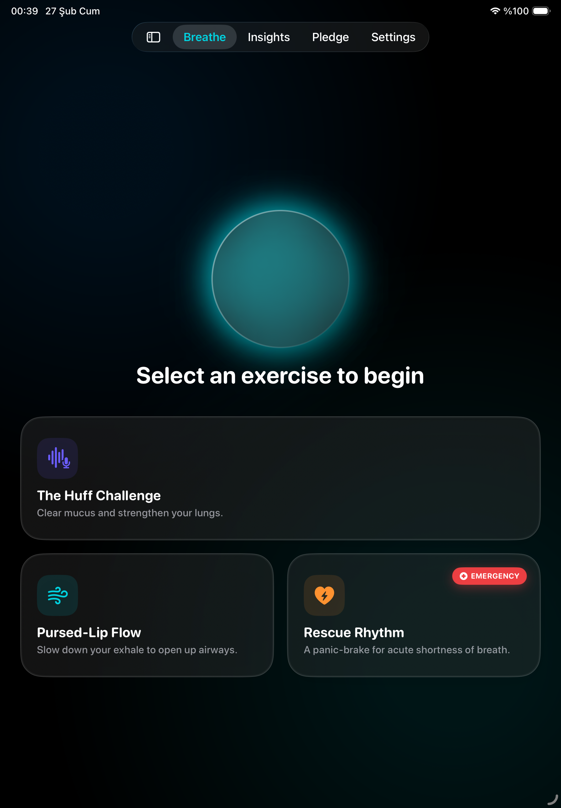
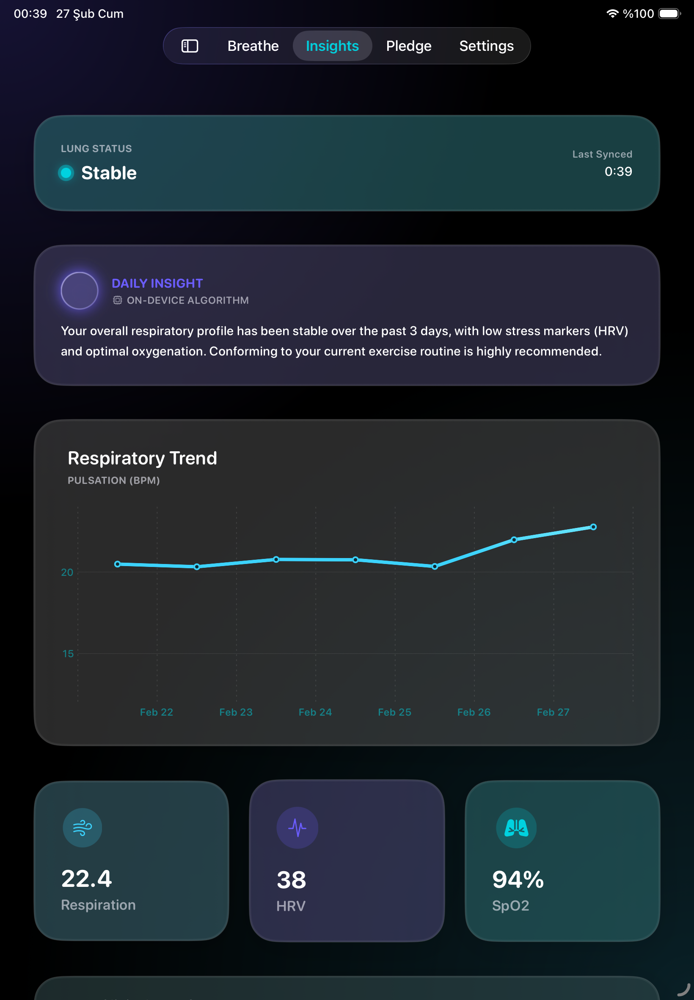
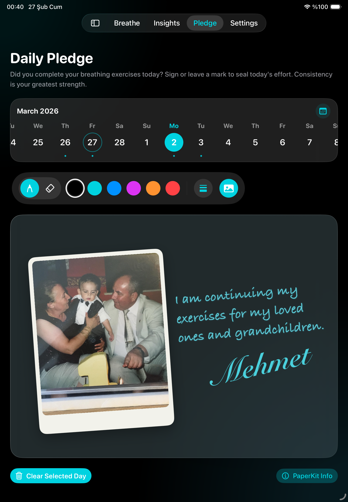

<div align="center">

# PulmoFlow 🫁
**Apple Swift Student Challenge 2026 Submission**

A privacy-first, on-device respiratory therapy and health tracking application optimized natively for iPadOS. Engineered to eliminate physical breathing tubes through real-time acoustic analysis.


<p align="center">
  
  
  
</p>

</div>

## 📌 Technical Overview

PulmoFlow is designed to push the computational limits of Apple's M-series processors inside a constrained App Playground environment (< 25MB constraint). It transforms strenuous medical exercises such as physiological "Huff" therapies into visually reactive, calm digital experiences by capturing and evaluating raw acoustic data via the device microphone.

There are **zero external dependencies**, no backend servers, and all processing is inherently off-grid, aligning with Apple's strict privacy-first ecosystem.

## 🛠 Architecture & Frameworks

### 1. Real-Time Acoustic Engine (`AVFoundation` & `Swift 6 Concurrency`)

Instead of generic microphone APIs, the app leverages **AVFoundation** to capture raw `AVAudioPCMBuffer` acoustic waves in real-time. 

- Calculations for logarithmic **Root Mean Square (RMS)** and **Peak Power** are processed entirely on the M-series hardware to instantly detect exhalations and coughs with zero-latency.
- To maintain a butter-smooth `60FPS` UI, the `BreathingEngine` isolates the heavy audio computations off the `@MainActor`, executing strictly on background `Task` queues via Swift 6 Concurrency principles.

### 2. Privacy-First Data Pipeline (`Core ML` & Ecosystem)

Data is treated as highly sensitive medical information. The entire architecture avoids network calls.

- **Core ML Foundation:** Setup natively to handle localized health metrics without routing data through web-based LLMs, strictly protecting patient confidentiality.
- **Apple Health Integration ready:** While playgrounds restrict live `HealthKit` requests, the app features fully structured *Mock Data Services* perfectly mirroring the actual `HKQuantityTypeIdentifier` (like `respiratoryRate`) making it entirely production-ready for the App Store.

### 3. Highly Accessible Engineering (`SwiftUI` & `HIG`)

Developed strictly adhering to Apple's **Human Interface Guidelines (HIG)**:
- **Calm UI via Liquid Glass:** Medical apps often suffer from cognitive overload. We implemented a native "Liquid Glass" design language providing contextual transparency without aggressive visual density.
- **Accessibility Integration:** Animations and reactive visual elements dynamically scale down by observing `@Environment(\.accessibilityReduceMotion)`. Fonts avoid hard-coding, fully inheriting from semantic definitions like `.largeTitle` enabling true **Dynamic Type**. VoiceOver structures rely on `.accessibilityElement(children: .combine)` to create logical navigation.

### 4. Zero-Latency Handwriting (`PaperKit`)

To allow patients to digitally sign a daily commitment pledge, the application employs the latest **PaperKit** updates. It offers a low-latency, hyper-responsive handwriting experience for Apple Pencil users, capturing signatures seamlessly without standard cumbersome drawing frameworks.

## 🚀 Getting Started

Since this is an **App Playground (`.swiftpm`)**, the easiest way to explore the codebase is natively on your iPad or Mac.

1. Clone the repository:
   ```bash
   git clone https://github.com/tunaarikaya/Fulmo-Flow--Swift-Student-Challenge-2026.git
   ```
2. Double-click the `Pulmo Flow.swiftpm` package.
3. Open in **Swift Playgrounds 4.4+** (iPad) or **Xcode 15/16** (Mac).
4. Run the application. Ensure microphone permissions are accepted for the full breathing interaction.

## 👨‍💻 Developer

Developed by **Mehmet Tuna Arıkaya**  
*(Computer Engineering Student & Open-Source Contributor)*

- [LinkedIn](https://www.linkedin.com/in/mehmet-tuna-ar%C4%B1kaya-9241b9248/)
- [X (Twitter)](https://x.com/tunaarikaya)
- [Medium](https://medium.com/@m.tunaarikaya)

*This application is completely open-sourced to aid aspiring iOS developers to learn how to manipulate audio buffers, build modular SwiftUI architectures, and prepare world-class Swift Student Challenge entries.*
